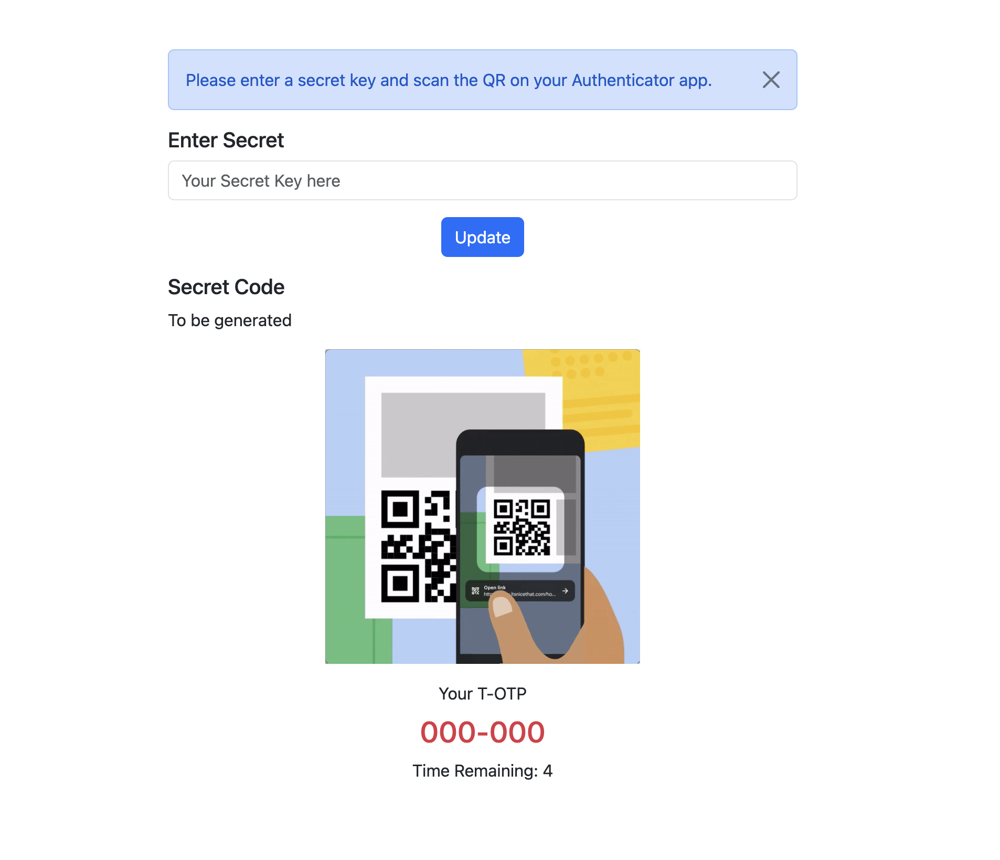
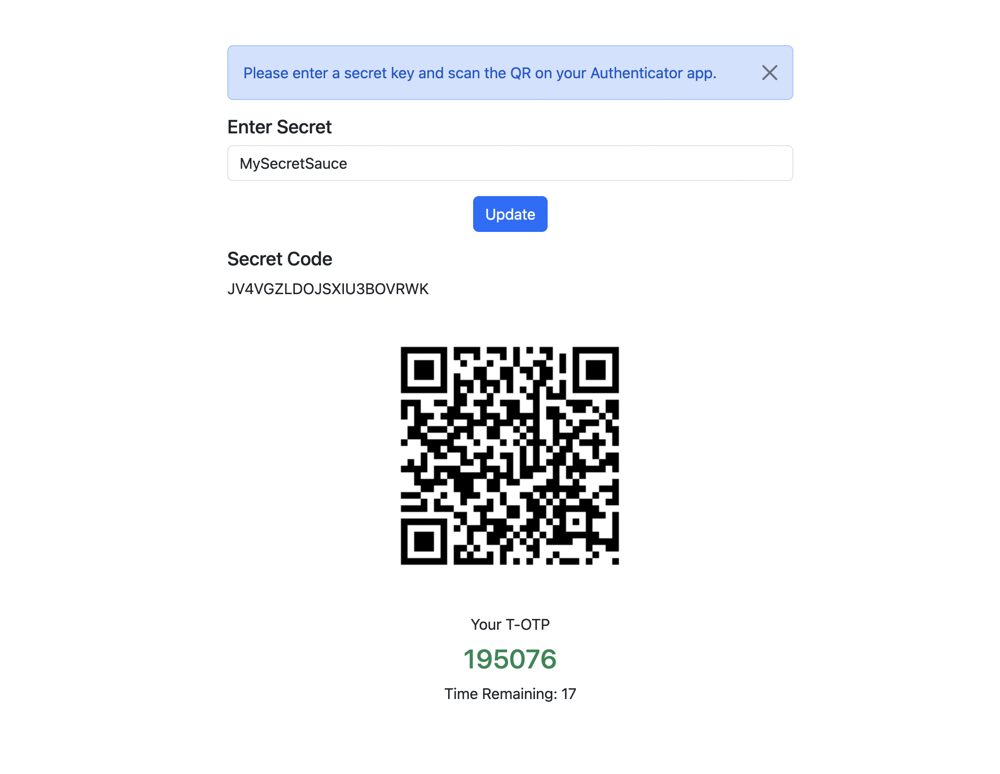

# TOTP Generator

Browser based Javascript for TOTP

## 1. Enter a secret key to generator your QR code

## 2. Scan the QR using Google Authenticator app

## 3. Use this as dual-factor auth
- Randomly generator new secret keys for your user and store them
- Ask users to scan the QR code to generator TOTP on authenticator apps